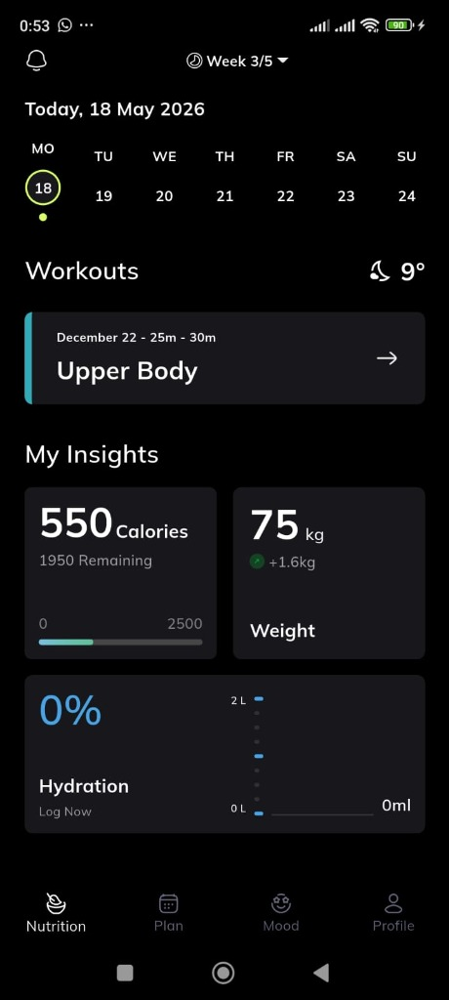
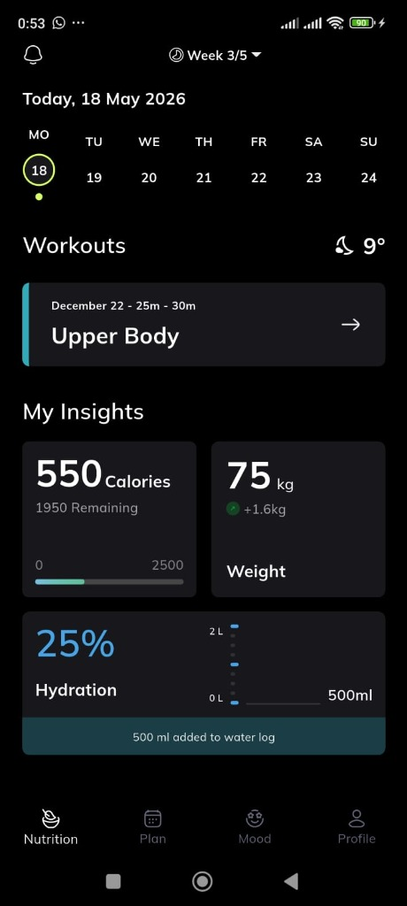
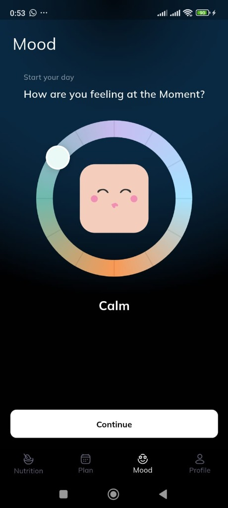
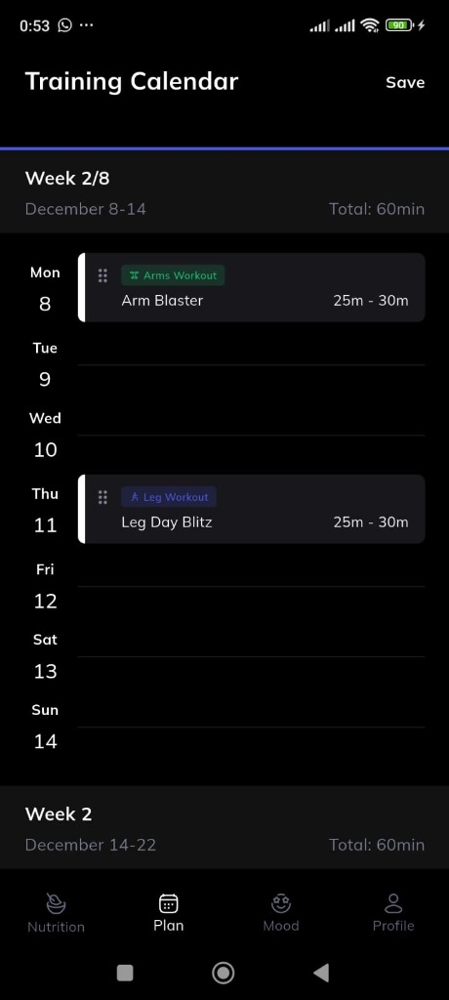
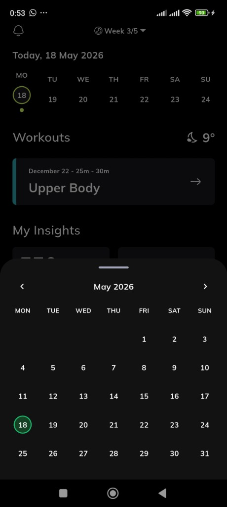

# Premium Fitness & Wellness Dashboard

A beautiful, high-fidelity, and responsive fitness and wellness mobile application built in Flutter using clean GetX architecture. The application is designed to deliver a premium user experience featuring active workout insights, calorie tracking, water intake monitoring, a drag-and-drop training calendar, and an interactive radial mood tracker.

---

## 📱 App Screenshots

| 🥗 Nutrition Dashboard | 💧 Hydration Log | 🧠 Mood Tracker |
| :---: | :---: | :---: |
|  |  |  |

| 📅 Training Calendar | 🗓️ Date Picker |
| :---: | :---: |
|  |  |

---

## 🛠️ Dependencies Used & Why

The project is built on top of robust, battle-tested third-party packages to ensure a scalable codebase and beautiful performance:

*   **`get` (GetX)**: Used as the core state management and routing solution. GetX separates our UI view files from business controllers using clean bindings, ensuring high-performance reactive stream updates (using `Obx`) without unnecessary widget rebuilds.
*   **`flutter_svg`**: Seamlessly renders crisp vector icons. Custom visual components, like the notification bell and custom bottom navigation bar icons, are loaded in SVG format to maintain perfect visual clarity across all screen densities.
*   **`flutter_screenutil`**: Ensures responsive styling. ScreenUtil extensions (`.sp`, `.w`, `.h`, `.r`) scale fonts, margins, paddings, and custom painted handle coordinates dynamically, preserving Figma layouts across smaller and larger smartphones alike.
*   **`intl`**: Sized and formatted calendar dates. This allows formatting timestamps and dynamically displaying local calendar ranges (e.g., "December 8-14" or "Today, 18 May 2026") inside the dashboard weekly bar and scrollable lists.

---

## 📁 Project Structure

The project follows a modular, clean architectural pattern to divide layout structures from logic blocks:

```
lib/
 └── app/
      ├── core/
      │    ├── theme/      # Typography configurations (Mulish font), colors, & SVG assets
      │    └── widgets/    # Shared premium widgets (Calendar Modal, Weekly Timeline, Custom Bottom Bar)
      ├── data/
      │    └── models/     # Strongly-typed models defining Workouts and Mood entities
      ├── modules/
      │    ├── home/       # Calorie tracking, water log trackers, & next workout card
      │    ├── mood/       # Circular custom painter mood slider & reactive squircle faces
      │    └── training/   # Drag-and-drop training calendar, day routines, & list items
      └── routes/
           # GetX routing bindings, router pages, & path configurations
```

---

## 🎯 Main Features & Interactions

1.  **Unified Health & Fitness Dashboard**:
    *   Dynamic calorie bar indicator representing target intake and consumption.
    *   Interactive fluid ounce logs allowing quick water logging with instant, reactive circular progress charts.
    *   Real-time weight tracker monitoring target benchmarks.
2.  **Drag-and-Drop Training Planner**:
    *   Smooth drag-and-drop interactions to reschedule routines like Arm Blaster and Leg Day Blitz between weekdays.
    *   Proportional visual accent strips, dragging placeholder state animations, and distinct category pills.
3.  **Circular Mood Tracker**:
    *   Custom painted sweep gradient radial track with 12 segment dividers.
    *   Floating outer-rim white handle with soft drop shadows that sweeps seamlessly around the track.
    *   Highly reactive squircle face assets loaded directly from Figma transparent layers, scaling and coloring dynamically.
4.  **Core Custom Navigation**:
    *   App-wide custom bottom navigation bar with pixel-perfect active status highlighting and GetX navigation stack management.

---

## 🎥 App Demonstration Video

A short screen-recording video demonstrating the high-fidelity features, smooth drag-and-drop training routines planner, custom painted circular mood slider, and overall seamless app navigation flows.

[Watch App Demo Video](https://drive.google.com/file/d/1LJEPgsaJMnIGzQDdrLm5KR06w6Yziiqq/view?usp=sharing)

---

## 🤖 Android APK Download

Download the ready-to-test production release Android application package (APK) directly to your Android device for instant testing.

[Download APK](https://drive.google.com/file/d/1VpZ1vYlN_46aloJ_7rRfszU44SWCL9yl/view?usp=sharing)

---

## 🔗 Quick Direct Links

For convenience, direct access links to all key project files and deliverables:

*   **Download Android APK**: [Download APK](https://drive.google.com/file/d/1VpZ1vYlN_46aloJ_7rRfszU44SWCL9yl/view?usp=sharing)
*   **Watch Application Demo Video**: [Watch App Demo Video](https://drive.google.com/file/d/1LJEPgsaJMnIGzQDdrLm5KR06w6Yziiqq/view?usp=sharing)
*   **View Repository Screenshots**: [View Screenshots](assets/screenshots/)

